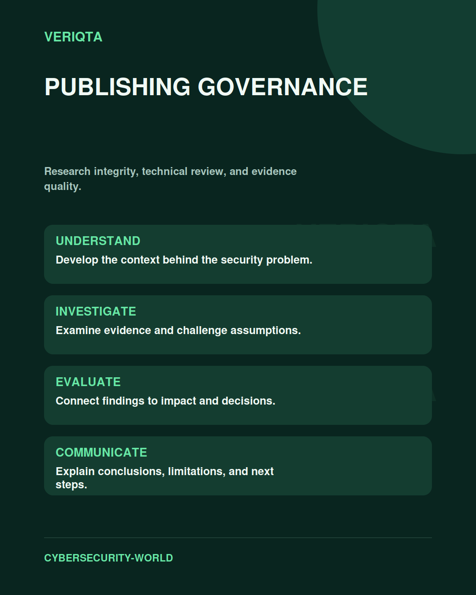

# Publishing Governance

Research integrity, technical review, and evidence quality.

Explore publishing governance through technical context, practical evidence, and professional judgement. Connect what you observe to the decisions you need to make, and explain the limits of your conclusions.

## Areas of study

- Editorial consistency and technical accuracy.
- Research and source verification.
- Evidence quality and professional review.
- Visual identity and publication decisions.

## Apply the discipline

Start with a question and establish the context. Identify relevant evidence, test your interpretation, and consider alternative explanations. Record what your evidence supports and what remains uncertain.

[Shared resources](../SHARED-RESOURCES) | [Publication releases](../PUBLICATION-RELEASES) | [Return to Cybersecurity World](../README.md)
