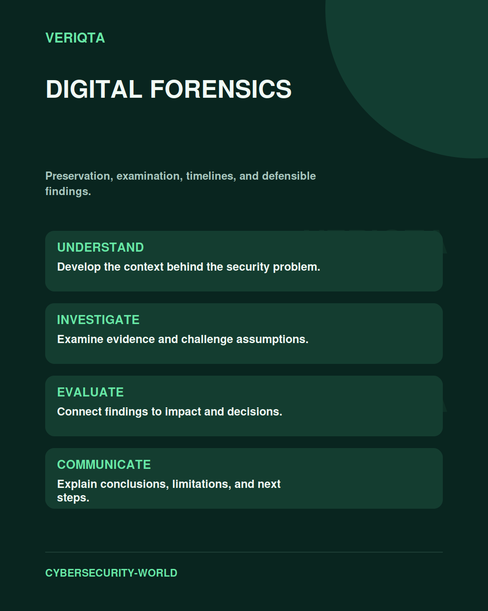

# Digital Forensics

Preservation, examination, timelines, and defensible findings.

Explore digital forensics through technical context, practical evidence, and professional judgement. Connect what you observe to the decisions you need to make, and explain the limits of your conclusions.

## Areas of study

- Evidence preservation and provenance.
- Endpoint, disk, memory, and cloud artefacts.
- Timeline reconstruction and corroboration.
- Findings, uncertainty, and reporting.

## Apply the discipline

Start with a question and establish the context. Identify relevant evidence, test your interpretation, and consider alternative explanations. Record what your evidence supports and what remains uncertain.

[Shared resources](../SHARED-RESOURCES) | [Publication releases](../PUBLICATION-RELEASES) | [Return to Cybersecurity World](../README.md)
