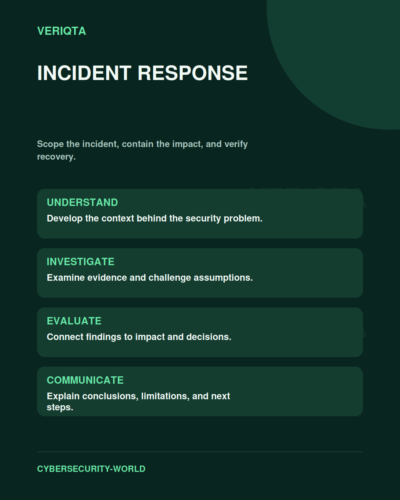

# Incident Response

Scope the incident, contain the impact, and verify recovery.

Explore incident response through technical context, practical evidence, and professional judgement. Connect what you observe to the decisions you need to make, and explain the limits of your conclusions.

## Areas of study

- Incident scope and business impact.
- Containment and investigation decisions.
- Recovery and verification.
- Communication and lessons learned.

## Apply the discipline

Start with a question and establish the context. Identify relevant evidence, test your interpretation, and consider alternative explanations. Record what your evidence supports and what remains uncertain.

[Shared resources](../SHARED-RESOURCES) | [Publication releases](../PUBLICATION-RELEASES) | [Return to Cybersecurity World](../README.md)
