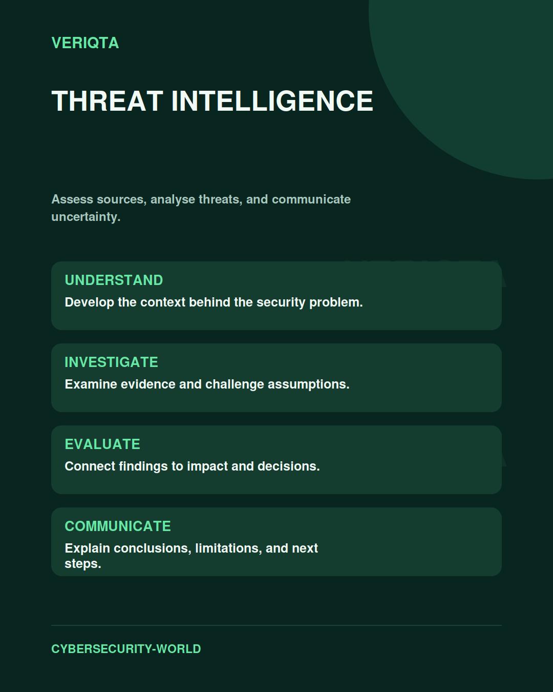

# Threat Intelligence

Assess sources, analyse threats, and communicate uncertainty.

Explore threat intelligence through technical context, practical evidence, and professional judgement. Connect what you observe to the decisions you need to make, and explain the limits of your conclusions.

## Areas of study

- Intelligence requirements and source quality.
- Threat behaviour and operating context.
- Analytical confidence and uncertainty.
- Useful intelligence for security decisions.

## Apply the discipline

Start with a question and establish the context. Identify relevant evidence, test your interpretation, and consider alternative explanations. Record what your evidence supports and what remains uncertain.

[Shared resources](../SHARED-RESOURCES) | [Publication releases](../PUBLICATION-RELEASES) | [Return to Cybersecurity World](../README.md)
