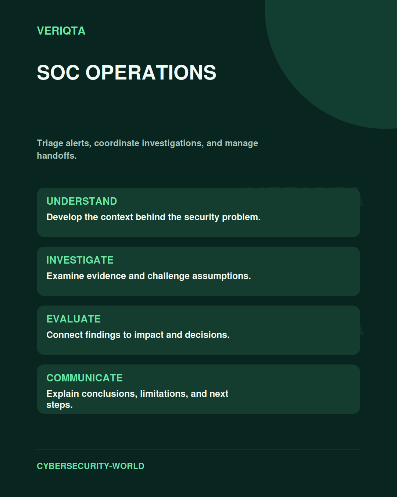

# SOC Operations

Triage alerts, coordinate investigations, and manage handoffs.

Explore soc operations through technical context, practical evidence, and professional judgement. Connect what you observe to the decisions you need to make, and explain the limits of your conclusions.

## Areas of study

- Alert triage and escalation.
- Investigation quality and case management.
- Shift handoffs and operational ownership.
- Team performance and service improvement.

## Apply the discipline

Start with a question and establish the context. Identify relevant evidence, test your interpretation, and consider alternative explanations. Record what your evidence supports and what remains uncertain.

[Shared resources](../SHARED-RESOURCES) | [Publication releases](../PUBLICATION-RELEASES) | [Return to Cybersecurity World](../README.md)
