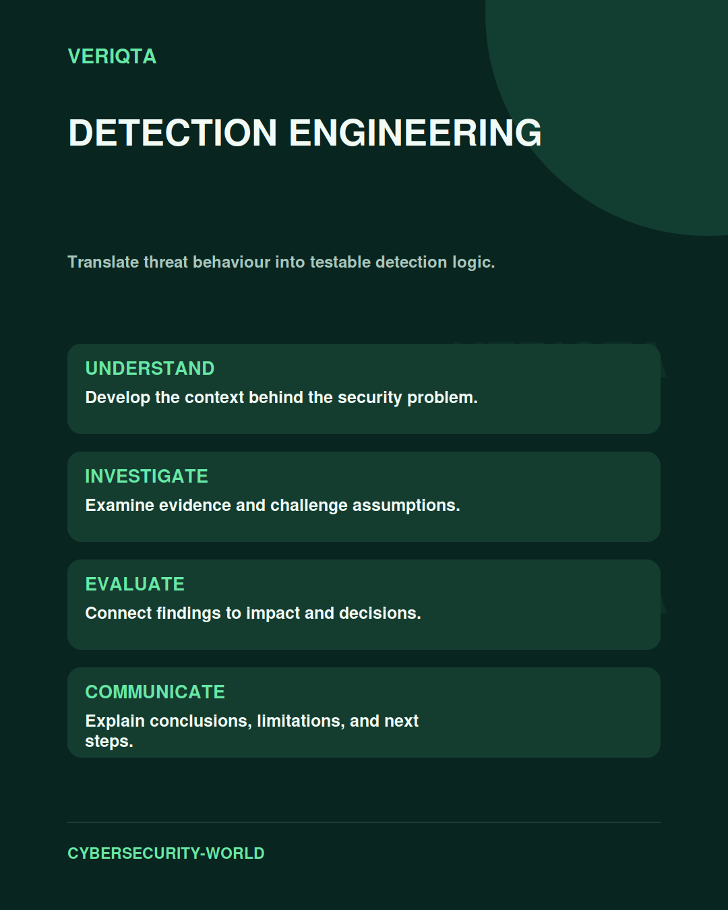

# Detection Engineering

Translate threat behaviour into testable detection logic.

Explore detection engineering through technical context, practical evidence, and professional judgement. Connect what you observe to the decisions you need to make, and explain the limits of your conclusions.

## Areas of study

- Threat behaviour and detection intent.
- Telemetry requirements and detection logic.
- Testing, tuning, and false positives.
- Coverage, maintenance, and validation.

## Apply the discipline

Start with a question and establish the context. Identify relevant evidence, test your interpretation, and consider alternative explanations. Record what your evidence supports and what remains uncertain.

[Shared resources](../SHARED-RESOURCES) | [Publication releases](../PUBLICATION-RELEASES) | [Return to Cybersecurity World](../README.md)
