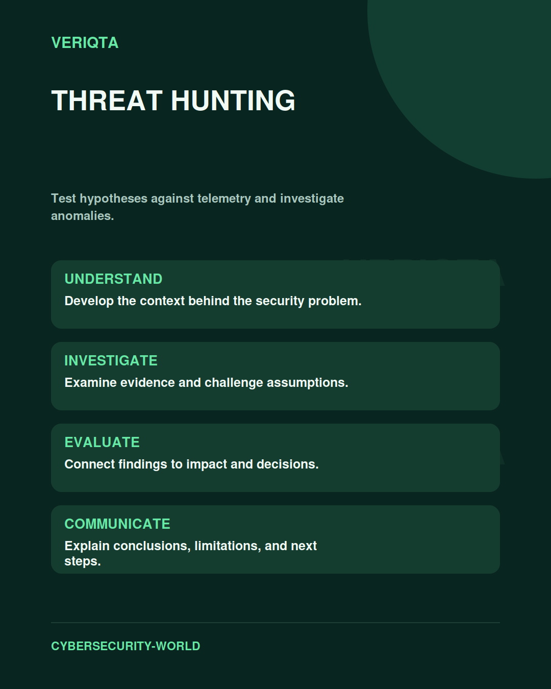

# Threat Hunting

Test hypotheses against telemetry and investigate anomalies.

Explore threat hunting through technical context, practical evidence, and professional judgement. Connect what you observe to the decisions you need to make, and explain the limits of your conclusions.

## Areas of study

- Hypothesis development.
- Telemetry selection and investigation.
- Alternative explanations and corroboration.
- Findings and detection opportunities.

## Apply the discipline

Start with a question and establish the context. Identify relevant evidence, test your interpretation, and consider alternative explanations. Record what your evidence supports and what remains uncertain.

[Shared resources](../SHARED-RESOURCES) | [Publication releases](../PUBLICATION-RELEASES) | [Return to Cybersecurity World](../README.md)
