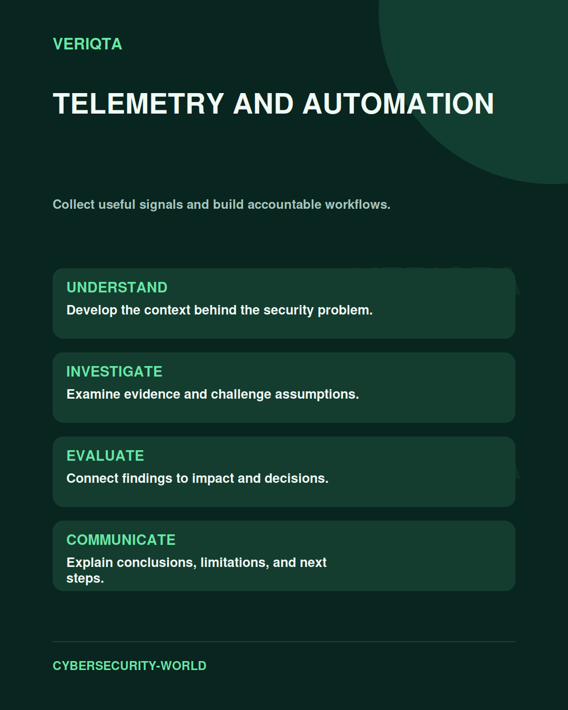

# Telemetry and Automation

Collect useful signals and build accountable workflows.

Explore telemetry and automation through technical context, practical evidence, and professional judgement. Connect what you observe to the decisions you need to make, and explain the limits of your conclusions.

## Areas of study

- Signal collection and data quality.
- Event context and correlation.
- Workflow design and human review.
- Automation failure handling and verification.

## Apply the discipline

Start with a question and establish the context. Identify relevant evidence, test your interpretation, and consider alternative explanations. Record what your evidence supports and what remains uncertain.

[Shared resources](../SHARED-RESOURCES) | [Publication releases](../PUBLICATION-RELEASES) | [Return to Cybersecurity World](../README.md)
