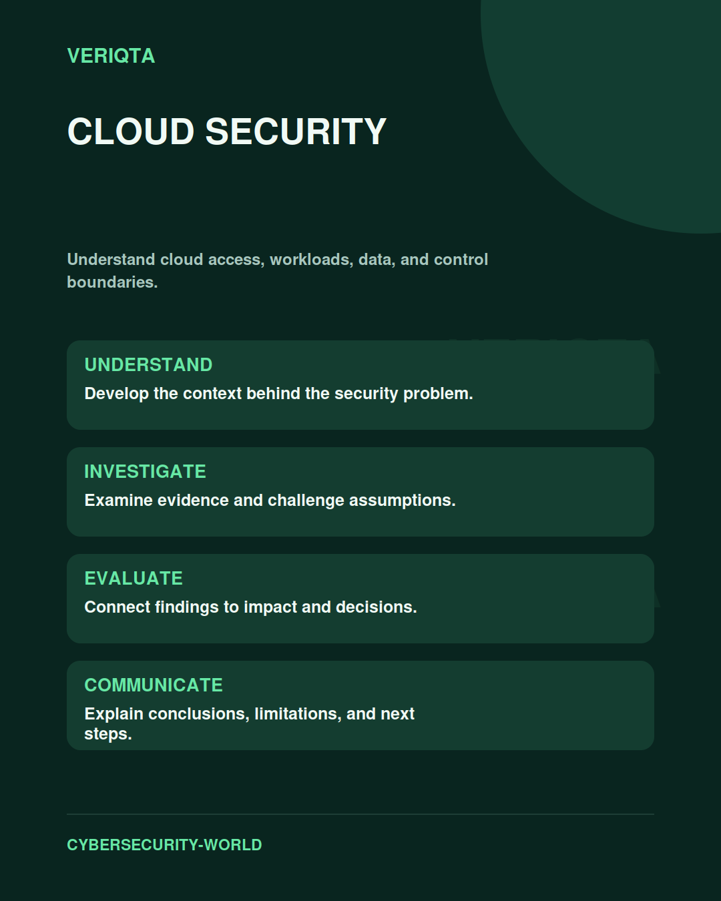

# Cloud Security

Understand cloud access, workloads, data, and control boundaries.

Explore cloud security through technical context, practical evidence, and professional judgement. Connect what you observe to the decisions you need to make, and explain the limits of your conclusions.

## Areas of study

- Identity and account boundaries.
- Network, workload, and data protection.
- Cloud audit evidence and investigation.
- Configuration review and response.

## Apply the discipline

Start with a question and establish the context. Identify relevant evidence, test your interpretation, and consider alternative explanations. Record what your evidence supports and what remains uncertain.

[Shared resources](../SHARED-RESOURCES) | [Publication releases](../PUBLICATION-RELEASES) | [Return to Cybersecurity World](../README.md)
