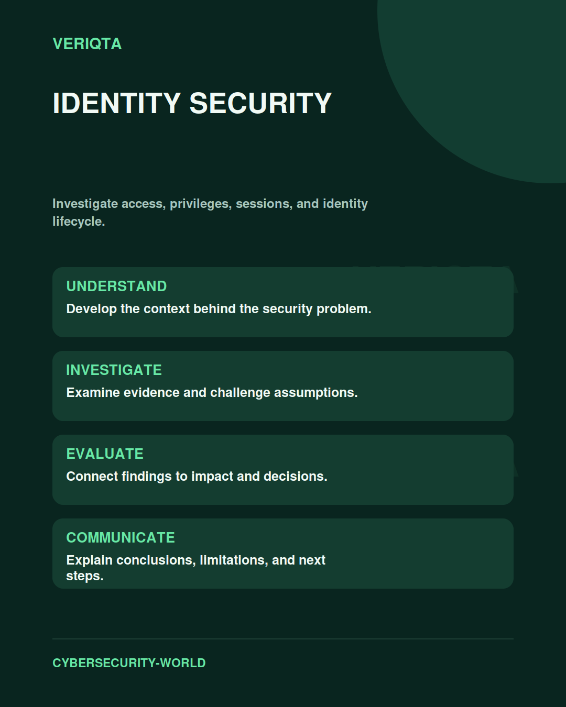

# Identity Security

Investigate access, privileges, sessions, and identity lifecycle.

Explore identity security through technical context, practical evidence, and professional judgement. Connect what you observe to the decisions you need to make, and explain the limits of your conclusions.

## Areas of study

- Account and privilege lifecycle.
- Authentication and session evidence.
- Access abuse and investigation.
- Least privilege and access review.

## Apply the discipline

Start with a question and establish the context. Identify relevant evidence, test your interpretation, and consider alternative explanations. Record what your evidence supports and what remains uncertain.

[Shared resources](../SHARED-RESOURCES) | [Publication releases](../PUBLICATION-RELEASES) | [Return to Cybersecurity World](../README.md)
