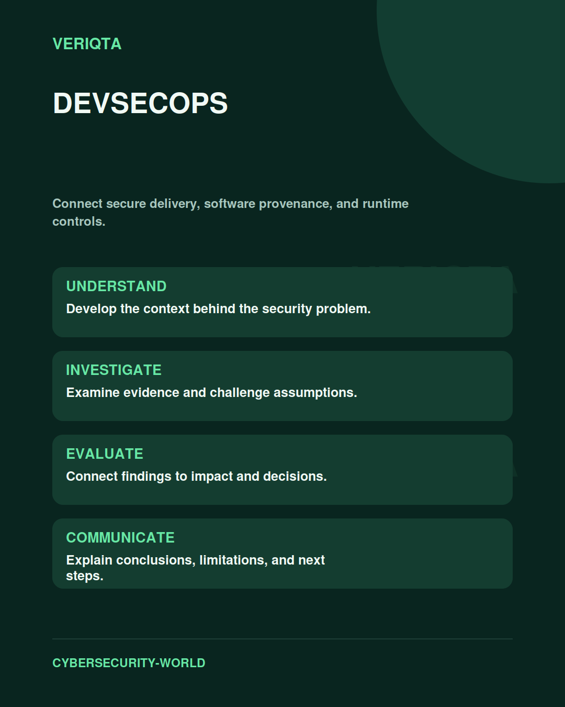

# DevSecOps

Connect secure delivery, software provenance, and runtime controls.

Explore devsecops through technical context, practical evidence, and professional judgement. Connect what you observe to the decisions you need to make, and explain the limits of your conclusions.

## Areas of study

- Secure development and delivery.
- Dependencies, artefacts, and provenance.
- Pipeline identity and permissions.
- Security testing and runtime feedback.

## Apply the discipline

Start with a question and establish the context. Identify relevant evidence, test your interpretation, and consider alternative explanations. Record what your evidence supports and what remains uncertain.

[Shared resources](../SHARED-RESOURCES) | [Publication releases](../PUBLICATION-RELEASES) | [Return to Cybersecurity World](../README.md)
