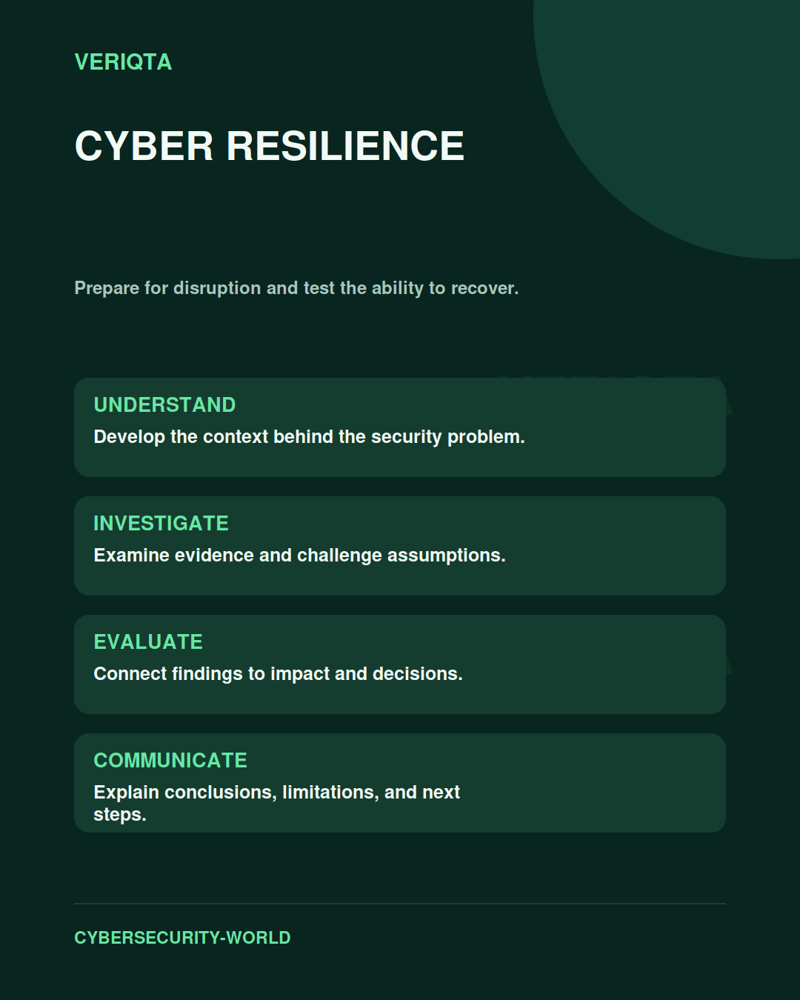

# Cyber Resilience

Prepare for disruption and test the ability to recover.

Explore cyber resilience through technical context, practical evidence, and professional judgement. Connect what you observe to the decisions you need to make, and explain the limits of your conclusions.

## Areas of study

- Business dependencies and recovery priorities.
- Backup integrity and restoration.
- Disruption exercises and failure scenarios.
- Recovery evidence and improvement.

## Apply the discipline

Start with a question and establish the context. Identify relevant evidence, test your interpretation, and consider alternative explanations. Record what your evidence supports and what remains uncertain.

[Shared resources](../SHARED-RESOURCES) | [Publication releases](../PUBLICATION-RELEASES) | [Return to Cybersecurity World](../README.md)
