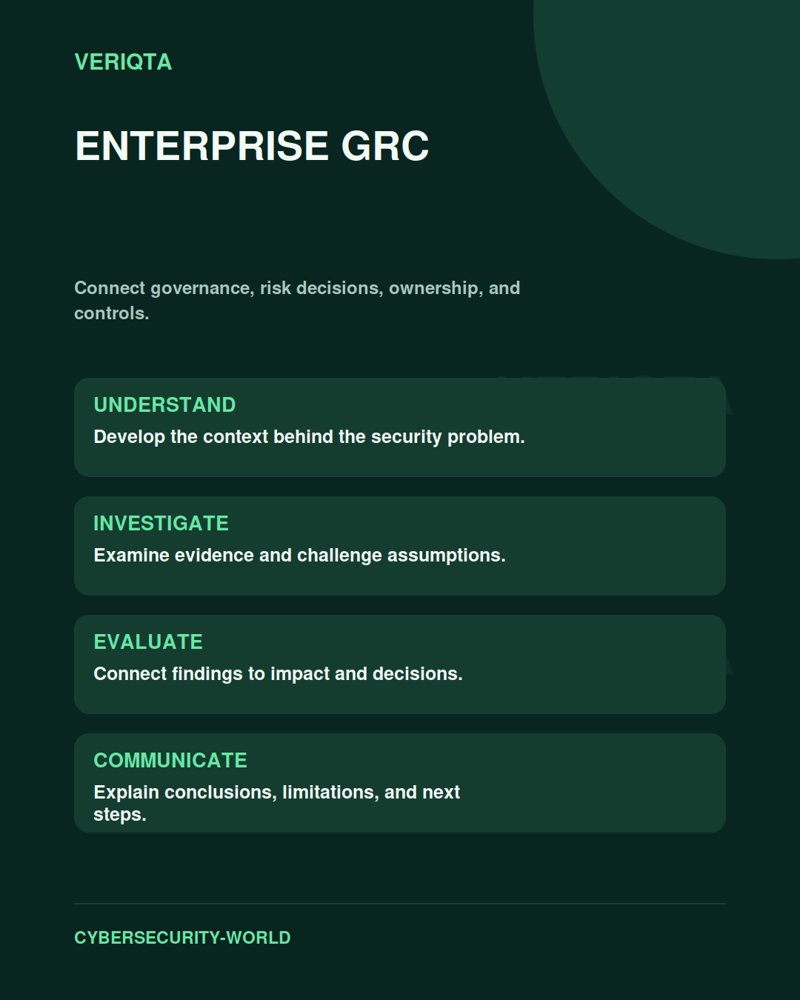

# Enterprise GRC

Connect governance, risk decisions, ownership, and controls.

Explore enterprise grc through technical context, practical evidence, and professional judgement. Connect what you observe to the decisions you need to make, and explain the limits of your conclusions.

## Areas of study

- Governance and accountable ownership.
- Risk assessment and treatment decisions.
- Control design and monitoring.
- Reporting and organisational context.

## Apply the discipline

Start with a question and establish the context. Identify relevant evidence, test your interpretation, and consider alternative explanations. Record what your evidence supports and what remains uncertain.

[Shared resources](../SHARED-RESOURCES) | [Publication releases](../PUBLICATION-RELEASES) | [Return to Cybersecurity World](../README.md)
