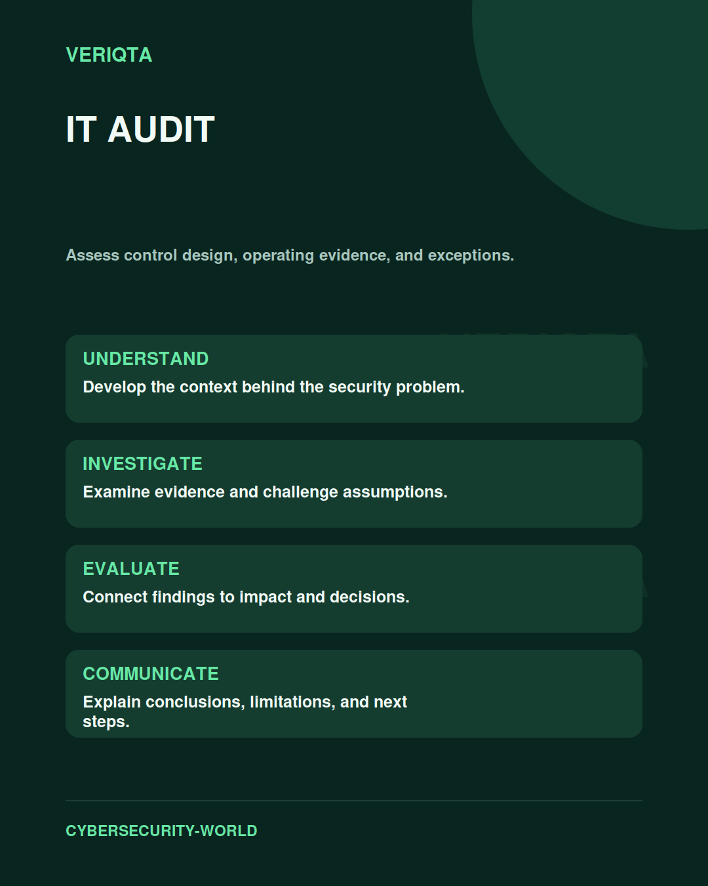

# IT Audit

Assess control design, operating evidence, and exceptions.

Explore it audit through technical context, practical evidence, and professional judgement. Connect what you observe to the decisions you need to make, and explain the limits of your conclusions.

## Areas of study

- Audit objectives and scoping.
- Control design and operating effectiveness.
- Evidence evaluation and exceptions.
- Findings and corrective actions.

## Apply the discipline

Start with a question and establish the context. Identify relevant evidence, test your interpretation, and consider alternative explanations. Record what your evidence supports and what remains uncertain.

[Shared resources](../SHARED-RESOURCES) | [Publication releases](../PUBLICATION-RELEASES) | [Return to Cybersecurity World](../README.md)
