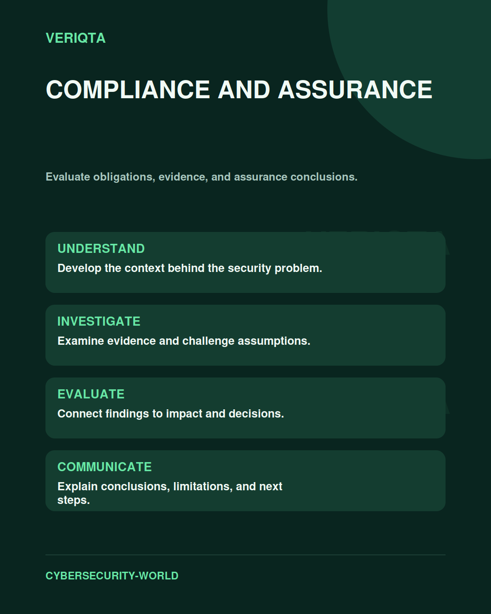

# Compliance and Assurance

Evaluate obligations, evidence, and assurance conclusions.

Explore compliance and assurance through technical context, practical evidence, and professional judgement. Connect what you observe to the decisions you need to make, and explain the limits of your conclusions.

## Areas of study

- Obligations and applicability.
- Control mapping and evidence.
- Assurance scope and limitations.
- Conclusions and remediation tracking.

## Apply the discipline

Start with a question and establish the context. Identify relevant evidence, test your interpretation, and consider alternative explanations. Record what your evidence supports and what remains uncertain.

[Shared resources](../SHARED-RESOURCES) | [Publication releases](../PUBLICATION-RELEASES) | [Return to Cybersecurity World](../README.md)
