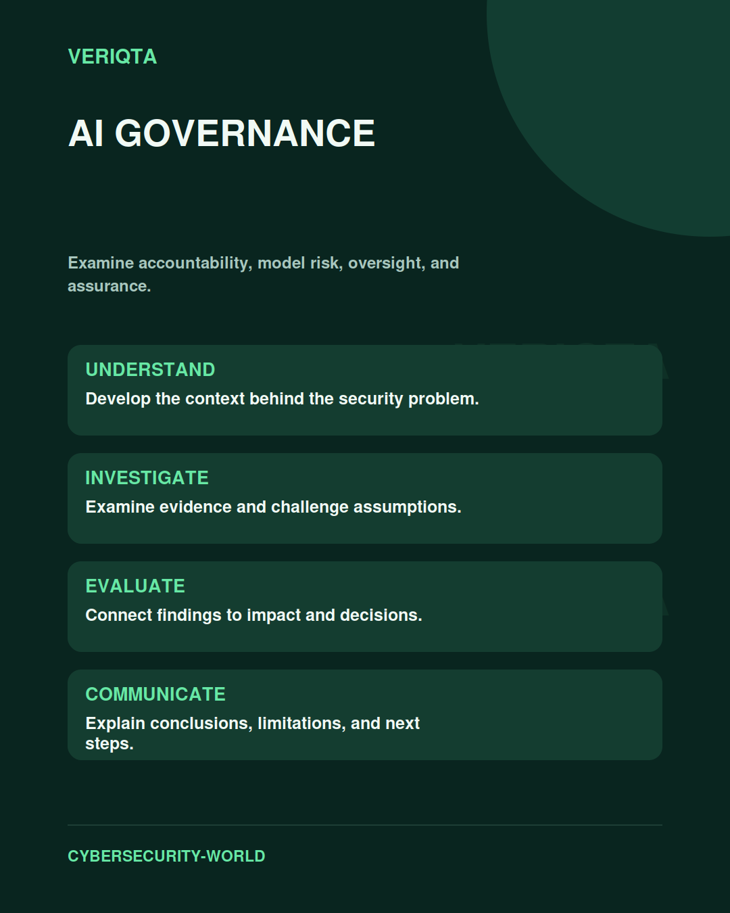

# AI Governance

Examine accountability, model risk, oversight, and assurance.

Explore ai governance through technical context, practical evidence, and professional judgement. Connect what you observe to the decisions you need to make, and explain the limits of your conclusions.

## Areas of study

- AI system inventory and accountability.
- Data, model, and operational risk.
- Human oversight and change review.
- Evaluation, monitoring, and assurance.

## Apply the discipline

Start with a question and establish the context. Identify relevant evidence, test your interpretation, and consider alternative explanations. Record what your evidence supports and what remains uncertain.

[Shared resources](../SHARED-RESOURCES) | [Publication releases](../PUBLICATION-RELEASES) | [Return to Cybersecurity World](../README.md)
