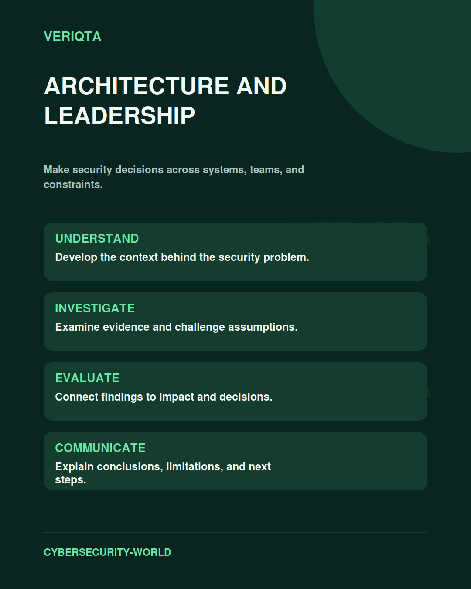

# Architecture and Leadership

Make security decisions across systems, teams, and constraints.

Explore architecture and leadership through technical context, practical evidence, and professional judgement. Connect what you observe to the decisions you need to make, and explain the limits of your conclusions.

## Areas of study

- System boundaries and trust relationships.
- Security tradeoffs and design decisions.
- Ownership and cross-team coordination.
- Communication and strategic judgement.

## Apply the discipline

Start with a question and establish the context. Identify relevant evidence, test your interpretation, and consider alternative explanations. Record what your evidence supports and what remains uncertain.

[Shared resources](../SHARED-RESOURCES) | [Publication releases](../PUBLICATION-RELEASES) | [Return to Cybersecurity World](../README.md)
