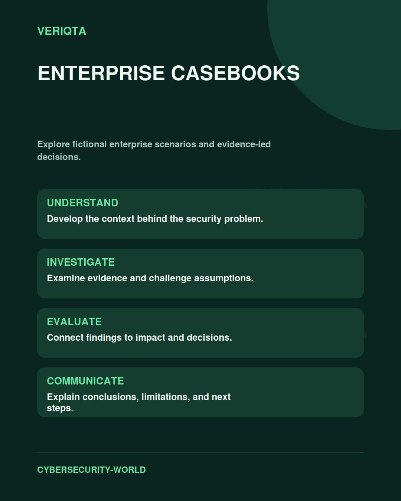

# Enterprise Casebooks

Explore fictional enterprise scenarios and evidence-led decisions.

Explore enterprise casebooks through technical context, practical evidence, and professional judgement. Connect what you observe to the decisions you need to make, and explain the limits of your conclusions.

## Areas of study

- Fictional organisations and operating context.
- Technical evidence and business constraints.
- Competing explanations and decisions.
- Case review and professional reflection.

## Apply the discipline

Start with a question and establish the context. Identify relevant evidence, test your interpretation, and consider alternative explanations. Record what your evidence supports and what remains uncertain.

[Shared resources](../SHARED-RESOURCES) | [Publication releases](../PUBLICATION-RELEASES) | [Return to Cybersecurity World](../README.md)
