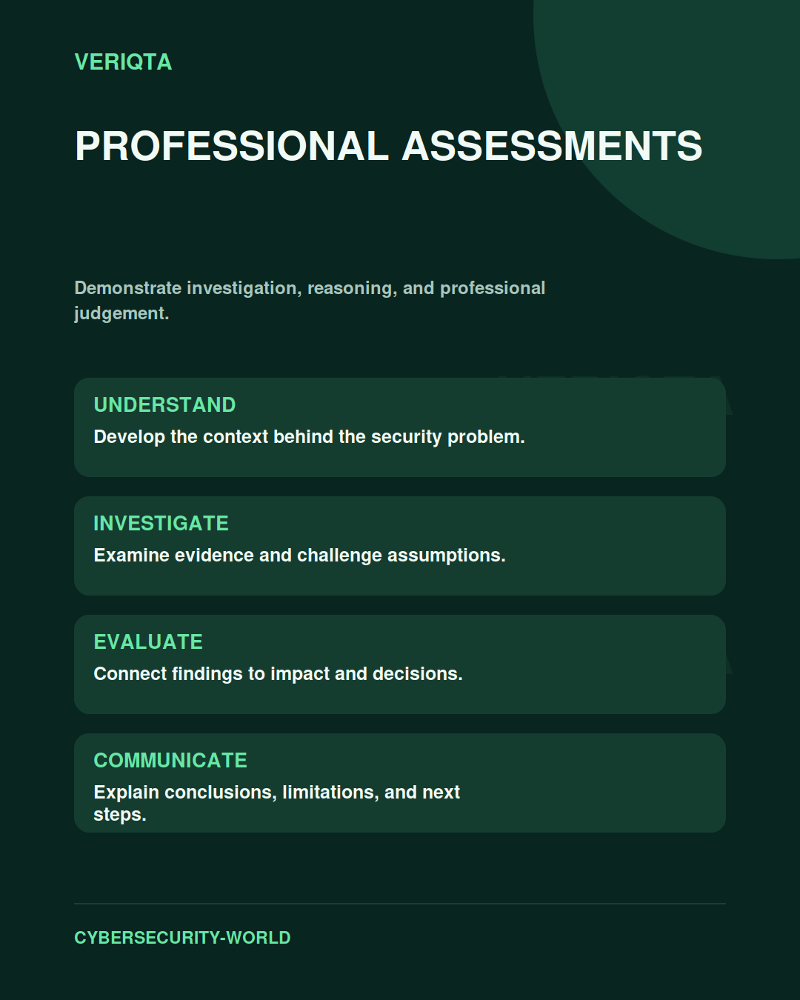

# Professional Assessments

Demonstrate investigation, reasoning, and professional judgement.

Explore professional assessments through technical context, practical evidence, and professional judgement. Connect what you observe to the decisions you need to make, and explain the limits of your conclusions.

## Areas of study

- Investigation and analysis tasks.
- Evidence-based reasoning.
- Clear professional communication.
- Assessment criteria and reflective review.

## Apply the discipline

Start with a question and establish the context. Identify relevant evidence, test your interpretation, and consider alternative explanations. Record what your evidence supports and what remains uncertain.

[Shared resources](../SHARED-RESOURCES) | [Publication releases](../PUBLICATION-RELEASES) | [Return to Cybersecurity World](../README.md)
