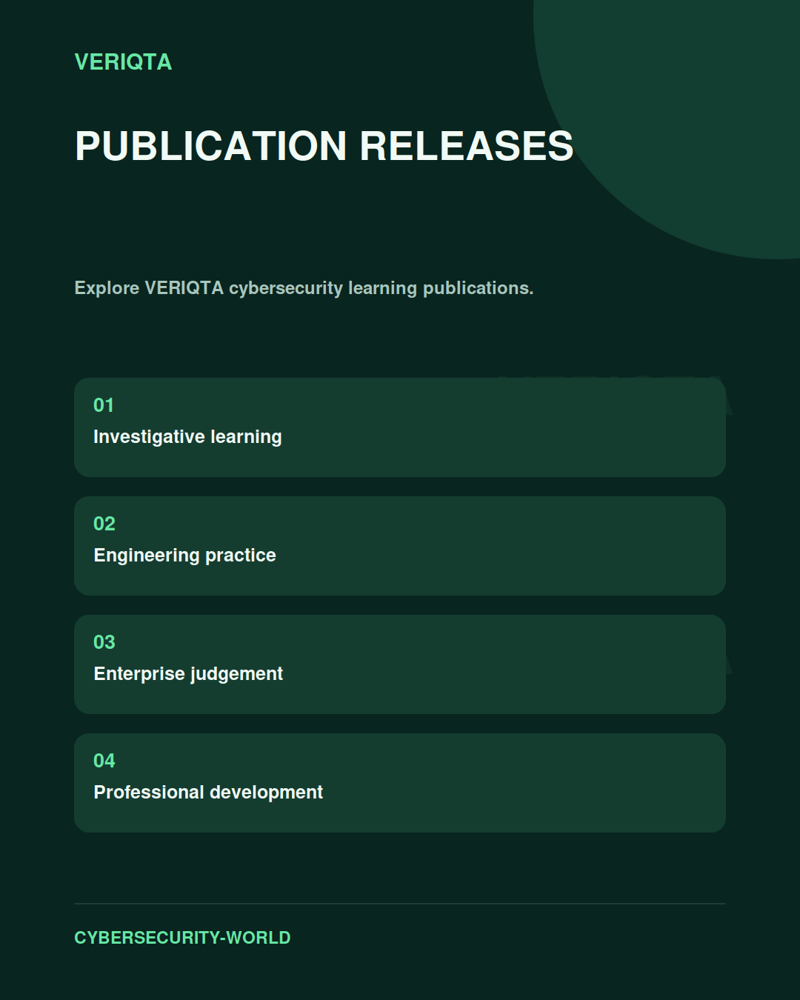

# Publication Releases

Explore VERIQTA cybersecurity learning publications across technical investigation, security engineering, governance, risk, audit, and professional judgement.

## Navigate the collection

Choose a discipline that matches your learning goal. Follow connections between technical evidence, operational decisions, enterprise risk, and assurance.

[Explore the disciplines](../README.md#explore-the-disciplines) | [Shared resources](../SHARED-RESOURCES/)

## Study with purpose

Use each publication to develop understanding, examine a problem in context, and practise reasoning you can explain. Record the evidence behind your conclusions and the limitations that affect your judgement.

[Return to Cybersecurity World](../README.md)
