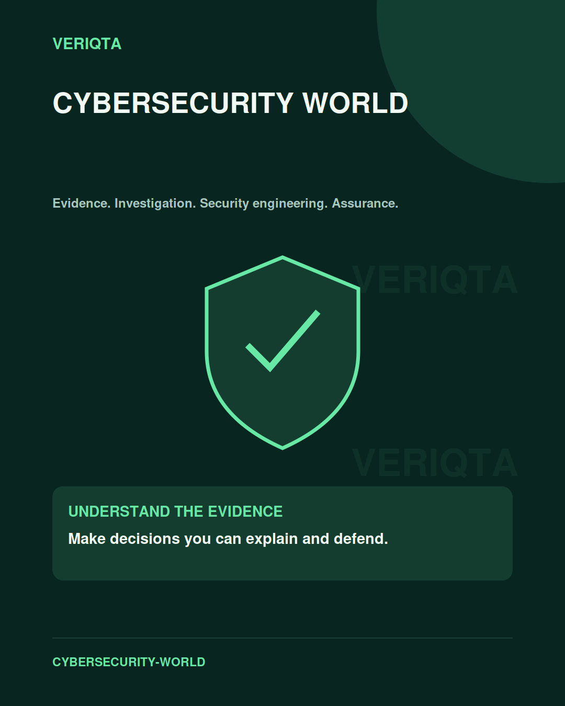
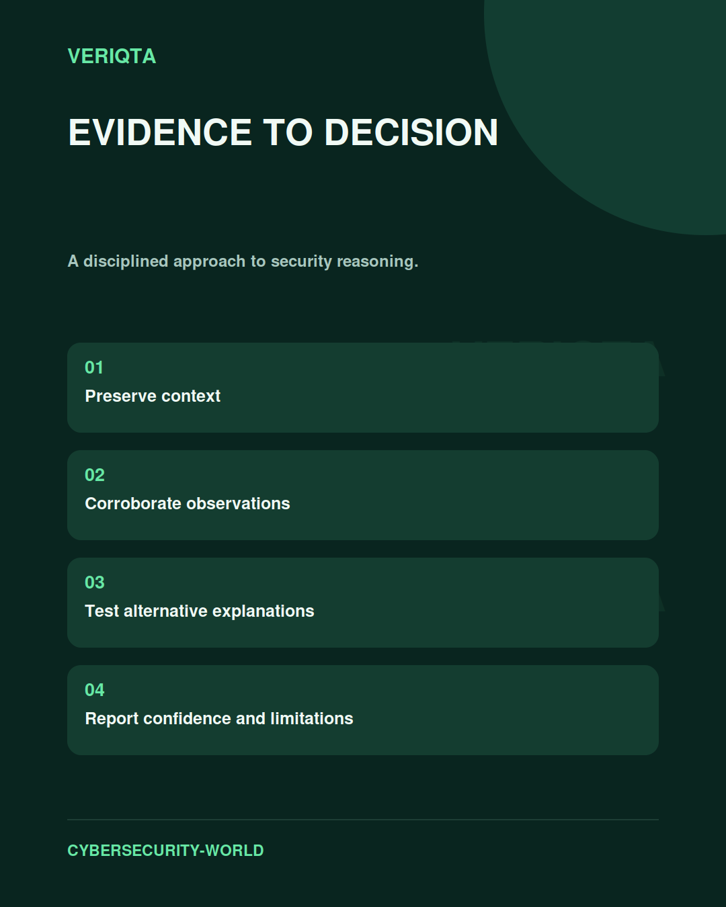

# VERIQTA CYBERSECURITY-WORLD

Evidence-led cybersecurity learning, engineering practice, and professional judgement.

CYBERSECURITY-WORLD connects technical investigation with the decisions organisations make about security, risk, resilience, and assurance. Explore digital forensics, incident response, intelligence, detection, cloud and identity security, DevSecOps, governance, audit, and leadership.

Follow a discipline or connect several perspectives around an enterprise case. Focus on evidence, clear reasoning, uncertainty, and conclusions you can explain.

## Explore the disciplines

| Area | Focus |
| :--- | :--- |
| [Publishing Governance](00-PUBLISHING-GOVERNANCE/) | Research integrity, technical review, and evidence quality. |
| [Digital Forensics](01-DIGITAL-FORENSICS/) | Preservation, examination, timelines, and defensible findings. |
| [Incident Response](02-INCIDENT-RESPONSE/) | Scope the incident, contain the impact, and verify recovery. |
| [Threat Intelligence](03-THREAT-INTELLIGENCE/) | Assess sources, analyse threats, and communicate uncertainty. |
| [SOC Operations](04-SOC-OPERATIONS/) | Triage alerts, coordinate investigations, and manage handoffs. |
| [Detection Engineering](05-DETECTION-ENGINEERING/) | Translate threat behaviour into testable detection logic. |
| [Threat Hunting](06-THREAT-HUNTING/) | Test hypotheses against telemetry and investigate anomalies. |
| [Telemetry and Automation](07-TELEMETRY-AND-AUTOMATION/) | Collect useful signals and build accountable workflows. |
| [Cloud Security](08-CLOUD-SECURITY/) | Understand cloud access, workloads, data, and control boundaries. |
| [Identity Security](09-IDENTITY-SECURITY/) | Investigate access, privileges, sessions, and identity lifecycle. |
| [DevSecOps](10-DEVSECOPS/) | Connect secure delivery, software provenance, and runtime controls. |
| [Cyber Resilience](11-CYBER-RESILIENCE/) | Prepare for disruption and test the ability to recover. |
| [Enterprise GRC](12-ENTERPRISE-GRC/) | Connect governance, risk decisions, ownership, and controls. |
| [IT Audit](13-IT-AUDIT/) | Assess control design, operating evidence, and exceptions. |
| [Compliance and Assurance](14-COMPLIANCE-AND-ASSURANCE/) | Evaluate obligations, evidence, and assurance conclusions. |
| [AI Governance](15-AI-GOVERNANCE/) | Examine accountability, model risk, oversight, and assurance. |
| [Architecture and Leadership](16-ARCHITECTURE-AND-LEADERSHIP/) | Make security decisions across systems, teams, and constraints. |
| [Enterprise Casebooks](17-ENTERPRISE-CASEBOOKS/) | Explore fictional enterprise scenarios and evidence-led decisions. |
| [Professional Assessments](18-PROFESSIONAL-ASSESSMENTS/) | Demonstrate investigation, reasoning, and professional judgement. |

## Build professional judgement

Study a problem in context. Separate observations from assumptions, compare competing explanations, and connect the findings to the affected systems and business decisions.

## Shared resources

Explore common resources across cybersecurity disciplines.

| Resource | Purpose |
| :--- | :--- |
| [Enterprise Lab Environments](SHARED-RESOURCES/enterprise-lab-environments/) | Controlled environments for technical practice. |
| [Synthetic Evidence Datasets](SHARED-RESOURCES/synthetic-evidence-datasets/) | Synthetic artefacts for investigation and analysis. |
| [Fictional Organizations](SHARED-RESOURCES/fictional-organizations/) | Fictional enterprise context for case-based learning. |
| [Professional Templates](SHARED-RESOURCES/professional-templates/) | Structures for investigation, review, and reporting. |
| [Architecture Diagrams](SHARED-RESOURCES/architecture-diagrams/) | Visual models of systems, dependencies, and controls. |
| [Case Study Library](SHARED-RESOURCES/case-study-library/) | Security scenarios and decision-making exercises. |
| [Source Registers](SHARED-RESOURCES/source-registers/) | Source context for research and verification. |
| [Assessment Rubrics](SHARED-RESOURCES/assessment-rubrics/) | Criteria for assessing evidence and reasoning. |
| [Glossary](SHARED-RESOURCES/glossary/) | Shared terminology across technical and assurance work. |

## Publication releases

Explore the collection through [publication releases](PUBLICATION-RELEASES/), or begin with a discipline that matches your learning goal.

## Learning approach

- Understand the systems, people, and constraints involved.
- Examine evidence and test your interpretation.
- Connect technical findings to risk and operational impact.
- Communicate conclusions and their limits clearly.

Technical practice belongs in authorised environments. Use synthetic evidence and fictional organisational context when sharing investigation work.
