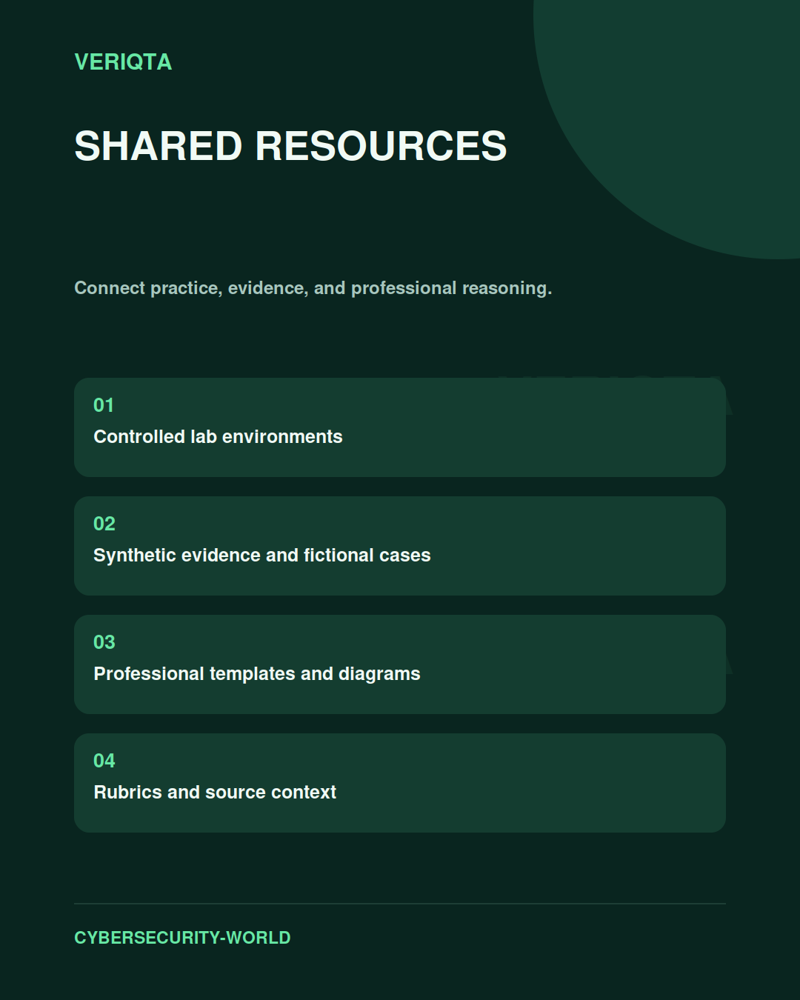

# Architecture Diagrams

Reason about systems through their boundaries, dependencies, and controls.

## Explore

- System components and data flows.
- Trust and identity boundaries.
- Control placement and operating dependencies.
- Failure paths and recovery considerations.

Use these resources to support your study across the cybersecurity disciplines. Keep the purpose, context, and limitations of each resource clear.

[Browse shared resources](../README.md) | [Return to Cybersecurity World](../../README.md)
